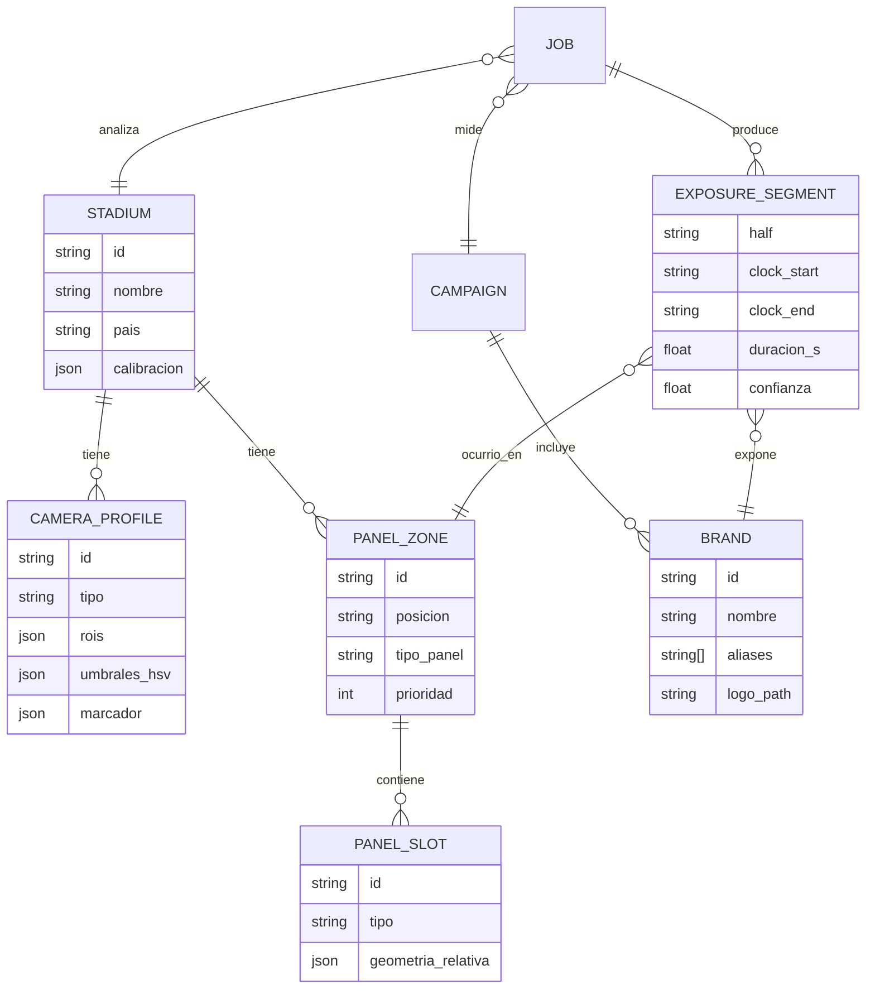
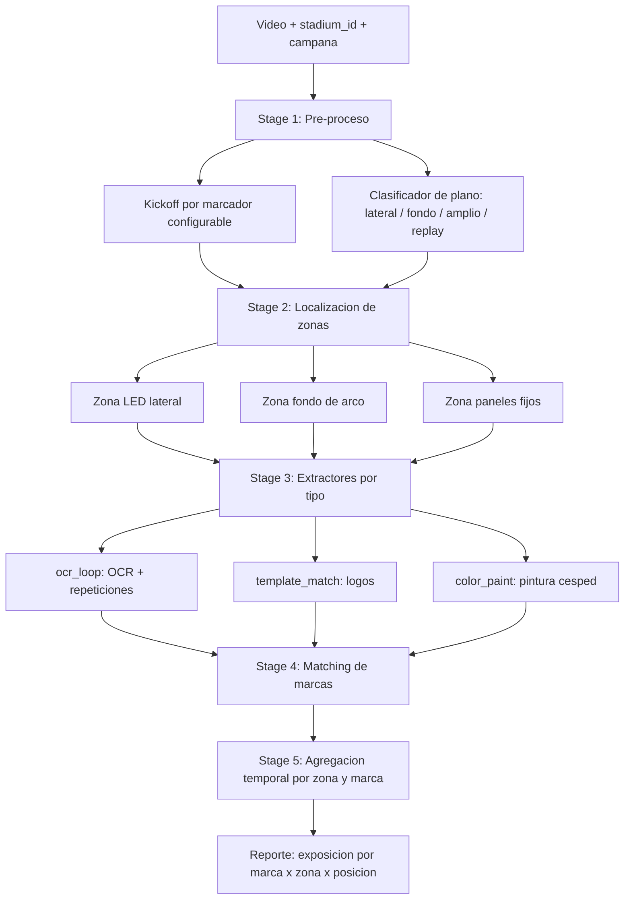
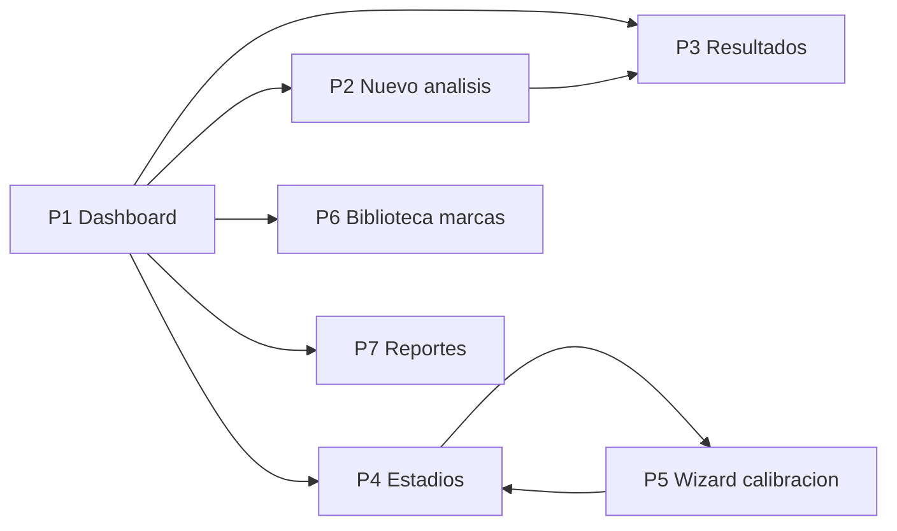
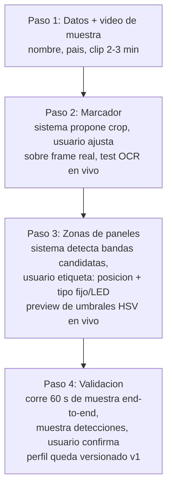
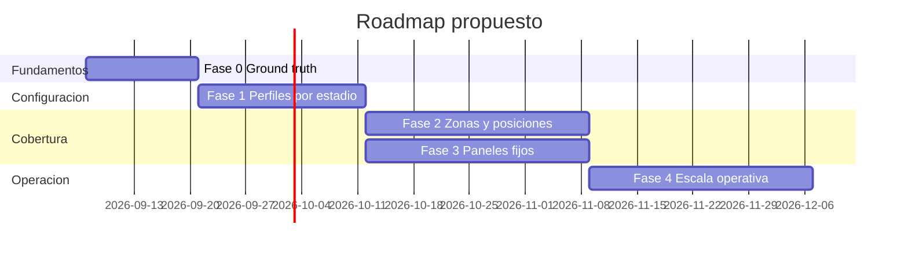

# Análisis: Escalamiento a medición multi-cancha

**Fecha:** 2026-09-03
**Contexto:** El sistema actual mide exposición de marcas en vallas LED de un solo estadio de referencia (broadcast LigaEcuabet). El nuevo objetivo es medir **varias canchas**, categorizando **paneles fijos vs. LED** y **posiciones dentro de la cancha**, de forma escalable.

---

## 1. Resumen ejecutivo

El proyecto actual es un pipeline heurístico (geometría + OCR + fuzzy matching) con toda la configuración **embebida en código**: umbrales HSV, posición del marcador, altura de la franja LED y reglas de paneles fijos están calibrados para un solo estadio. Funciona bien para ese caso, pero no escala.

La recomendación es **evolucionar, no reescribir** (justificación completa en sección 3, incluida comparación con el estado del arte de la industria): conservar el núcleo del pipeline (ROI → OCR → matching → agregación temporal) y reestructurar el proyecto alrededor de cuatro ejes:

1. **Configuración por estadio** (perfiles declarativos versionados, no constantes en código).
2. **Modelo de dominio de inventario publicitario** (zonas, tipos de panel, posiciones de cancha).
3. **Estrategia de detección diferenciada por tipo de panel** (LED = OCR de loop; fijo = matching visual de logo/template).
4. **Experiencia de operación simple** (sección 6): estadio conocido = subir video y listo; estadio nuevo = wizard de calibración único de ~15-20 minutos, sin fotos ni planos, solo un clip de muestra.

---

## 2. Estado actual: qué sirve y qué no

### 2.1 Lo que se conserva (activos reutilizables)

| Componente | Archivo | Por qué se conserva |
|---|---|---|
| Orquestador del análisis | [backend/app/pipeline/run.py](backend/app/pipeline/run.py) | Loop de muestreo y emisión de progreso ya resueltos |
| Recorte de valla LED | [backend/app/pipeline/roi.py](backend/app/pipeline/roi.py) | La heurística césped→touchline→banda LED es sólida; necesita parametrización, no reemplazo |
| OCR compartido | [backend/app/pipeline/ocr.py](backend/app/pipeline/ocr.py) | RapidOCR singleton, upscale adaptativo |
| Matching de marcas | [backend/app/pipeline/brands.py](backend/app/pipeline/brands.py) | Normalización + fuzzy + regla de repeticiones del loop LED |
| Agregación temporal | [backend/app/pipeline/aggregate.py](backend/app/pipeline/aggregate.py), [hysteresis.py](backend/app/pipeline/hysteresis.py) | Segmentos con tolerancia a gaps: lógica de negocio correcta |
| Detección de kickoff | [backend/app/pipeline/scoreboard.py](backend/app/pipeline/scoreboard.py) | Concepto correcto; crop debe ser configurable |
| API + SSE + jobs | [backend/app/main.py](backend/app/main.py), [jobs.py](backend/app/jobs.py) | Contrato funcional con el frontend |
| UI de resultados | [frontend/src/app/page.tsx](frontend/src/app/page.tsx) | Tabla por marca, segmentos, thumbnails |

### 2.2 Lo que bloquea el escalamiento

| Limitación | Impacto en multi-cancha |
|---|---|
| Constantes HSV/geometría hardcodeadas en `roi.py` | Césped seco, iluminación diurna, LED de otros colores → fallos silenciosos |
| `_mask_fixed_banner_columns` específico de LigaEcuabet | La categorización fijo vs. LED no es generalizable |
| Crop de marcador fijo (`0.22H × 0.42W`) | Otras cadenas/países mueven el scoreboard |
| Solo cámara lateral | No cubre fondos de arco, esquinas, ni paneles detrás del gol |
| Sin noción de "estadio" ni "zona" en el modelo de datos | Imposible reportar por posición de cancha |
| Cola única en memoria, 1 job a la vez | No escala a lotes de partidos |
| Logos subidos no se usan en detección | Desperdicia la señal más fuerte para paneles fijos |
| Sin ground truth ni tests con video real | No hay forma de medir precisión al cambiar de cancha |

---

## 3. ¿Evolucionar o reescribir? Evaluación del núcleo

### 3.1 Contexto: cómo lo resuelve la industria

Estado del arte en medición de patrocinio deportivo (investigación 2025-2026):

| Enfoque | Referencia | Precisión reportada | Costo de entrada |
|---|---|---|---|
| **Detección ML con OBB** (YOLOv11 orientado) | ExposureEngine (arXiv 2510.04739, liga sueca) | mAP@0.5 = 0.859, precisión 0.96 | Alto: 1,103 frames etiquetados a mano, 670 logos, fine-tuning por dominio |
| **VLM open-vocabulary** (Gemma, sin entrenamiento) | Tracer (open source) | Orientado a recall; scoring de calidad por aparición | Medio: costo de cómputo por frame alto (VLM por frame) |
| **APIs comerciales** (logo recognition + scoreboard OCR) | API4AI y similares | Buena cobertura de marcas globales | Bajo técnico, alto económico; marcas regionales ecuatorianas probablemente fuera de catálogo |
| **Heurística + OCR** (enfoque actual del proyecto) | Este repo | Sin baseline medido aún (Fase 0 lo corrige) | Ya pagado |

Observación clave: los enfoques ML/VLM destacan en **detección de logos sin texto** (jerseys, autos, vallas con solo isotipo) y en marcas globales conocidas. Para **vallas LED con texto cambiante y marcas regionales** (NETT plus, ECUABET), el OCR + fuzzy matching es estructuralmente superior: no requiere que el modelo "conozca" la marca, lee lo que el LED muestra. Los modelos pre-entrenados y APIs comerciales fallan exactamente en el nicho de este proyecto.

### 3.2 Veredicto por componente

| Componente | Veredicto | Justificación |
|---|---|---|
| `video.py` (I/O, seek) | **Conservar** | Genérico, sin acoplamiento a estadio |
| `scoreboard.py` (kickoff) | **Parametrizar** | Concepto correcto y alineado con industria (scoreboard OCR es práctica estándar); solo el crop es frágil |
| `roi.py` (localización LED) | **Parametrizar ahora, extender después** | La heurística césped→touchline→banda es una ventaja: funciona sin entrenar nada por estadio. Se vuelve un "localizador de zona" más entre varios |
| `ocr.py` (RapidOCR) | **Conservar** | Suficiente para LED; evaluar alternativas solo si Fase 0 muestra techo |
| `brands.py` (matching) | **Conservar + extender** | Fuzzy + regla de loop es lógica de negocio valiosa; se suma logo matching para fijos |
| `hysteresis.py` / `aggregate.py` | **Conservar tal cual** | Agregación temporal es independiente del estadio; solo cambia la clave (marca → marca+zona) |
| `jobs.py` / `main.py` | **Reescritura parcial** | No por algoritmo sino por infraestructura: persistencia y cola. Es la parte más débil hoy |
| `frontend` | **Evolucionar** | Base Next.js sólida; crecerá con wizard de calibración y reportes (ver sección 6) |

### 3.3 Matriz de decisión

| Criterio | Evolucionar | Reescribir (p. ej. YOLO-OBB desde cero) |
|---|---|---|
| Tiempo a 2ª cancha funcionando | 2-3 semanas (Fase 1) | 2-3 meses (dataset + entrenamiento + pipeline nuevo) |
| Conocimiento acumulado | Se conserva (garbles OCR, reglas de loop, histéresis ya resueltos) | Se descarta |
| Riesgo | Bajo: cada fase es reversible | Alto: precisión del nuevo sistema no garantizada |
| Dependencia de datos etiquetados | Ninguna para LED | Obligatoria y por liga/estadio |
| Techo de precisión en LED con texto | Alto (OCR lee contenido real) | Similar, pero exige reentrenar ante marcas nuevas |
| Cobertura de logos sin texto (fijos, jerseys) | Requiere extensión (Fase 3) | Nativa |

**Veredicto: evolucionar.** La reescritura con detección ML pura solo se justificaría si el objetivo cambiara a "detectar cualquier logo en cualquier superficie sin configuración" (jerseys, overlays, fondos de entrevista a escala de liga completa). Ese no es el problema planteado: el problema es **medir inventario conocido (vallas y paneles) en canchas conocidas con configuración mínima**. Para ese problema, el núcleo actual es el correcto y su deuda es de parametrización, no de concepto.

Puntos donde ML sí entra como complemento evolutivo (sin reescritura):

1. **Clasificador de plano** (Fase 2): CNN liviana cuando haya frames etiquetados; empieza heurístico.
2. **Logo matching para fijos** (Fase 3): embeddings o feature matching contra logos de campaña.
3. **OBB detection** (horizonte Fase 5+): si se expande a overlays virtuales o inventario sin texto, adoptar enfoque tipo ExposureEngine sobre las zonas ya localizadas — el pipeline por etapas lo absorbe como un extractor más.

---

## 4. Modelo de dominio propuesto

El concepto clave: separar **el estadio** (infraestructura física, cambia poco) de **la campaña** (qué marca ocupa qué espacio, cambia por partido) y del **análisis** (la medición en sí).



### 3.1 Taxonomía de posiciones de cancha

Catálogo estándar de la industria de medición de patrocinio (adaptable):

| Posición | Descripción | Visibilidad típica |
|---|---|---|
| `LATERAL_MAIN` | Valla LED línea lateral, lado de cámara principal | Alta (la actual) |
| `LATERAL_OPPOSITE` | Valla lateral opuesta (visible en planos abiertos) | Media |
| `BEHIND_GOAL_LEFT` / `BEHIND_GOAL_RIGHT` | Vallas detrás de cada arco | Alta en jugadas de área |
| `CORNER_QUADRANT` | Tramos cortos en esquinas | Baja-media |
| `FIXED_BOARD_MIDFIELD` | Panel estático insertado en la fila LED (caso LigaEcuabet) | Alta pero estática |
| `CARPET_3D` | Alfombra virtual/física junto a la línea | Media |
| `INTERVIEW_BACKDROP` | Fondo de entrevistas / flash zone | Post-partido |
| `SCOREBOARD_OVERLAY` | Gráfico del broadcast (no es panel físico) | Separar siempre |

### 3.2 Taxonomía de tipos de panel

| Tipo | Señal dominante | Método de detección |
|---|---|---|
| `LED_DYNAMIC` | Texto cambiante, alto brillo, loop repetido | OCR + regla de ≥2 repeticiones (ya existe) |
| `LED_STATIC_CONTENT` | LED mostrando contenido fijo | OCR + logo matching |
| `FIXED_PRINT` | Lona/pintura mate, sin emisión | Template/logo matching (no OCR) |
| `VIRTUAL_OVERLAY` | Insertado por el broadcast, perspectiva perfecta | Detección por homografía + logo matching |
| `PAINTED_GRASS` | Pintura sobre césped | Detección por color + logo matching |

**Decisión de diseño:** el tipo de panel determina el *extractor* que se ejecuta sobre la zona. Un mismo `PANEL_ZONE` puede declarar slots mixtos (fila LED con insertos fijos, como hoy).

---

## 5. Arquitectura propuesta

### 4.1 Principio rector: config-driven

Todo lo que hoy es constante pasa a un **perfil de estadio versionado** (YAML/JSON en repo, luego DB):

```yaml
# stadiums/estadio-ejemplo.yaml
stadium:
  id: "capwell"
  nombre: "Estadio Monumental Ejemplo"
  pais: "EC"

camera_profiles:
  - id: "main_lateral_hd"
    tipo: "LATERAL_MAIN"
    resolucion_ref: [1920, 1080]
    scoreboard_crop: { x: 0.0, y: 0.0, w: 0.42, h: 0.22 }
    grass_hsv:
      lower: [28, 25, 30]
      upper: [85, 255, 255]
    led_band:
      top_frac: 0.12
      height_frac: 0.055
      min_height_px: 28
      max_height_px: 90

panel_zones:
  - id: "led_lateral_main"
    posicion: "LATERAL_MAIN"
    tipo_panel: "LED_DYNAMIC"
    slots:
      - tipo: "LED_DYNAMIC"
        extractor: "ocr_loop"
      - tipo: "FIXED_PRINT"
        extractor: "template_match"
        mascara: { estrategia: "matte_yellow", textura_max: 0.3 }
```

El pipeline recibe el perfil y resuelve los parámetros; el código deja de conocer estadios concretos.

### 4.2 Pipeline por etapas con extractores intercambiables



Puntos clave:

- **Clasificador de plano (nuevo):** antes de buscar zonas, decidir qué muestra el frame (lateral cerrado, plano amplio, fondo de arco, replay, gráfico). Hoy esto es implícito en los gates de skip (`low_grass`, `wide_shot`); debe ser una etapa explícita que enruta el frame a los localizadores de zona pertinentes. Empieza heurístico (geometría del césped + líneas) y puede evolucionar a un clasificador liviano (CNN pequeña) cuando haya datos etiquetados.
- **Extractores por tipo de panel:** interfaz común `extract(zone_crop, brands) -> list[Detection]`. `ocr_loop` es el actual; `template_match` usa los logos que hoy se suben y no se usan (feature matching con ORB/SIFT o embeddings de una red liviana); `color_paint` para pintura en césped.
- **Agregación por zona:** los segmentos dejan de ser solo por marca y pasan a ser por `(marca, zona, posición)`. La histéresis y el cierre de segmentos se reutilizan tal cual, aplicados por serie independiente.

### 4.3 Detección diferenciada: fijo vs. LED

Esta es la pregunta central del análisis. La respuesta: **no usar el mismo método para ambos**.

| Aspecto | LED dinámico | Panel fijo |
|---|---|---|
| Naturaleza | Texto/gráfico cambiante en loop | Imagen permanente |
| Señal temporal | Repeticiones del loop (≥2) | Persistencia total (siempre visible si está en cuadro) |
| Método primario | OCR + fuzzy (actual) | Template matching del logo |
| Método de respaldo | Logo matching (contenido estático en LED) | OCR (texto grande en lona) |
| Métrica de exposición | Segundos con detección positiva | Segundos en cuadro × % de área visible |
| Confusión típica | Garbles OCR por color/brillo | Oclusión por jugadores, plano parcial |

Para paneles fijos la métrica cambia: no basta "presente/ausente", interesa **% de área visible** y **tamaño en pantalla** (un panel fijo visible al 30% en un plano amplio no vale lo mismo que uno completo en primer plano). Esto sugiere extender `FrameObservation` con `visible_area_ratio` y `screen_size_px` por detección.

### 4.4 Separación de responsabilidades en módulos

```
backend/app/
├── domain/            # Stadium, CameraProfile, PanelZone, Campaign (Pydantic)
├── config/            # Carga y validación de perfiles YAML
├── pipeline/
│   ├── stages/
│   │   ├── preprocess.py    # kickoff + clasificador de plano
│   │   ├── locate.py        # localizadores de zona (por posición)
│   │   ├── extract/         # ocr_loop.py, template_match.py, color_paint.py
│   │   ├── match.py         # brands.py evolucionado
│   │   └── aggregate.py     # por (marca, zona)
│   └── run.py               # orquesta stages con el perfil cargado
├── jobs/              # Cola persistente (SQLite primero, Redis después)
└── api/               # main.py dividido en routers
```

---

## 6. Diseño de interfaz y flujo de configuración

### 6.1 Respuestas directas a las preguntas de diseño

**¿Subir el video basta?**
Solo si el estadio ya está calibrado. El flujo se divide en dos modos:

- **Estadio conocido:** subir video + elegir estadio + marcas → analizar. Igual de simple que hoy.
- **Estadio nuevo:** calibración única asistida de ~15-20 minutos (wizard, sección 6.3). Después de eso, el estadio queda guardado y todo partido posterior es "subir video y listo".

**¿Hay que taguear el video por categoría?**
Mínimo indispensable: `estadio` (obligatorio), `condición` (día/noche — un mismo estadio puede necesitar dos variantes de perfil por iluminación) y `cadena/torneo` (determina el overlay del marcador). El sistema puede **sugerir** la condición automáticamente analizando brillo del primer frame, y el usuario confirma.

**¿Se necesitan imágenes previas del estadio?**
No fotos profesionales ni planos. El wizard extrae **frames representativos del propio video de muestra** que el usuario sube en calibración. Lo único que sí se necesita de antemano son los **logos de las marcas** cuando el estadio tiene paneles fijos (el template matching los requiere); para LED puro, el nombre basta.

**¿Base de datos para los puntos de la cancha?**
Sí. Las zonas de cada estadio (posición, geometría relativa, tipo de panel, umbrales) se persisten versionadas. SQLite al inicio; el esquema está en 6.4.

### 6.2 Inventario de pantallas (7)



| # | Pantalla | Contenido | ¿Existe hoy? |
|---|---|---|---|
| P1 | **Dashboard** | Lista de partidos analizados, estado de jobs, acceso rápido a último resultado | Parcial (solo job activo) |
| P2 | **Nuevo análisis** | Upload video(s), selector de estadio + variante (día/noche), marcas de la campaña, ventana (5/10/full) | Sí (evolucionar la actual) |
| P3 | **Resultados** | Tabla por marca (actual) + desglose por zona/posición/tipo de panel, timeline de exposición, thumbnails, export CSV | Parcial (sin desglose por zona) |
| P4 | **Estadios** | Catálogo: nombre, país, estado de calibración, fecha de última validación, precisión conocida | No |
| P5 | **Wizard de calibración** | 4 pasos asistidos (detalle en 6.3) | No |
| P6 | **Biblioteca de marcas** | Marcas reutilizables: nombre, aliases, logo, historial de exposición | No (hoy se reingresan por job) |
| P7 | **Reportes comparativos** | Multi-partido: exposición por marca a lo largo de una temporada, por estadio, por posición; export Excel/PDF | No |

Prioridad de construcción: P2 y P3 evolucionan en Fases 1-2; P4+P5 en Fase 1 (son la herramienta de calibración); P6 en Fase 3 (logos para fijos); P7 en Fase 4.

### 6.3 Wizard de calibración de estadio (P5)

Cuatro pasos, una sola vez por estadio:



Decisiones de diseño del wizard:

- **El sistema propone, el humano confirma.** Nada de formularios vacíos: cada paso llega con una detección automática pre-llenada (crop de marcador candidato, bandas LED candidatas, umbrales HSV estimados del propio clip).
- **Preview en vivo:** cada ajuste de umbral o crop re-renderiza el frame de muestra con el resultado. El operador ve el recorte LED y la lectura OCR al instante.
- **Variantes de perfil:** al final del wizard se ofrece "guardar variante día/noche" si el clip lo amerita.
- **Re-calibración:** si Fase 5 detecta deriva de precisión, el wizard se reabre en el paso conflictivo con datos nuevos, no desde cero.

### 6.4 Esquema de base de datos (conceptos de cancha)

SQLite suficiente hasta decenas de usuarios; migrable a Postgres en Fase 4 sin cambiar el modelo:

```sql
stadiums(id, nombre, pais, ciudad, created_at)

camera_profiles(id, stadium_id → stadiums, variante,  -- 'dia' | 'noche' | 'default'
                version, scoreboard_crop_json, grass_hsv_json,
                led_band_json, activo, created_at)

panel_zones(id, profile_id → camera_profiles,
            posicion,          -- LATERAL_MAIN | BEHIND_GOAL_L | ...
            tipo_panel,        -- LED_DYNAMIC | FIXED_PRINT | MIXED
            geometria_json,    -- anclas relativas del frame
            estrategia_fijo_json,  -- mascara/separacion fijo-vs-LED
            prioridad)

calibration_runs(id, profile_id → camera_profiles,
                 clip_job_id, precision_report_json, created_at)
                 -- historial de validaciones: permite detectar deriva

brands(id, nombre, aliases_json, logo_path, created_at)

jobs(id, stadium_id, profile_id, mode, duration_mode,
     status, created_at, result_json)

exposure_segments(id, job_id → jobs, brand_id → brands,
                  zone_id → panel_zones,   -- clave del desglose por posicion
                  half, clock_start, clock_end,
                  duracion_s, area_visible_ratio, confianza)
```

Puntos importantes:

- **`camera_profiles` versionado:** cada re-calibración crea versión nueva; los jobs guardan qué versión usaron → resultados históricos reproducibles.
- **`exposure_segments.zone_id`:** es la columna que habilita todos los reportes por posición de cancha.
- **`calibration_runs`:** guarda la precisión medida en cada validación; base del monitoreo de deriva de Fase 5.

### 6.5 Carga de trabajo para el operador (resumen)

| Situación | Esfuerzo |
|---|---|
| Partido en estadio conocido | Subir video + confirmar 3 campos. ~1 minuto |
| Estadio nuevo | Wizard único de 15-20 min con clip de muestra |
| Marca nueva (LED) | Agregar nombre en biblioteca. 30 segundos |
| Marca nueva (panel fijo) | Nombre + subir logo. 1 minuto |
| Re-calibración por deriva | Paso puntual del wizard, ~5 min |

---

## 7. Fases del proyecto

Cada fase tiene criterio de salida verificable. No avanzar sin cumplirlo.

### Fase 0 — Instrumentación y ground truth (1-2 semanas)

**Objetivo:** poder medir antes de cambiar.

- Crear dataset de evaluación: 3-5 clips cortos (2-5 min) por cancha nueva, anotados manualmente (marca, zona, segundo inicio/fin).
- Script de evaluación: corre el pipeline sobre el dataset y reporta precisión/recall por marca y por zona, y error en segundos totales.
- Congelar el caso canónico actual (LigaEcuabet) como regresión automatizada con video real.
- Limpiar deuda: eliminar `backend/:memory:.ses` del working tree, commitear o descartar cambios pendientes.

**Criterio de salida:** número baseline de precisión por marca en la cancha actual, reproducible con un comando.

### Fase 1 — Externalización de configuración (2-3 semanas)

**Objetivo:** una segunda cancha funciona sin tocar código Python.

- Mover todas las constantes de `roi.py`, `scoreboard.py` y `brands.py` a perfiles YAML validados con Pydantic (`domain/` + `config/`).
- `POST /jobs` acepta `stadium_id` (o perfil inline para pruebas).
- Herramienta de calibración asistida: dado un frame, sugiere umbrales HSV y crops; el operador ajusta y guarda el perfil. Puede ser una página simple en el frontend.
- Tests: mismo frame sintético, distintos perfiles → distintos resultados esperados.

**Criterio de salida:** segunda cancha real medida con precisión comparable al baseline, solo agregando un YAML.

### Fase 2 — Modelo de zonas y posiciones (3-4 semanas)

**Objetivo:** reportar por posición de cancha.

- Implementar `PanelZone` y clasificador de plano heurístico.
- Localizadores de zona adicionales: fondo de arco (misma heurística césped→banda, anclada a geometría de fondo), esquinas.
- Agregación por `(marca, zona, posición)`; API y frontend muestran desglose.
- Extender observaciones con `visible_area_ratio` y tamaño en pantalla.

**Criterio de salida:** reporte de un partido desglosado por posición, validado contra ground truth de Fase 0 con precisión acordada (sugerencia: ≥85% en segundos por marca-zona).

### Fase 3 — Detección de paneles fijos (3-4 semanas)

**Objetivo:** categorizar y medir `FIXED_PRINT` con logos.

- Extractor `template_match`: feature matching (ORB + homografía RANSAC) o embeddings (p. ej. MobileNet/DINOv2 liviano) contra logos de la campaña.
- Generalizar `_mask_fixed_banner_columns` como estrategia configurable de enmascarado/separación fijo-vs-LED dentro de una fila.
- Métricas específicas de fijo: % área visible, tamaño en pantalla, oclusión.
- Decidir umbral de confianza y política de respaldo OCR↔logo.

**Criterio de salida:** medición simultánea LED + fijos en la cancha de referencia (caso LigaEcuabet: separar LIGAECUABET fijo de ECUABET dinámico de forma automática y correcta).

### Fase 4 — Escalamiento operativo (2-4 semanas)

**Objetivo:** procesar lotes de partidos, no uno a la vez.

- Persistencia: SQLite (jobs, resultados, estadios) — suficiente hasta decenas de usuarios.
- Cola con workers: `arq` o `dramatiq` (Redis) si hay volumen; paralelizar por partido y por mitad.
- Almacenamiento: política de retención de videos, resultados en DB, debug crops con TTL.
- API: listado histórico de jobs, comparación entre partidos, export CSV/Excel por marca y zona.
- Opcional: contenedores Docker para deploy reproducible.

**Criterio de salida:** lote de N partidos encolados y procesados sin intervención; reporte consolidado exportable.

### Fase 5 — Calidad continua y expansión (permanente)

- Cada cancha nueva: calibración asistida + clip de validación + entrada al dataset de regresión.
- Métricas de deriva: si la precisión de una cancha cae, alertar (cambio de iluminación, nuevo proveedor LED, nuevo overlay de broadcast).
- Backlog evolutivo: clasificador de plano con ML, tracking de jugadores para oclusión, detección de overlays virtuales, GPU si el volumen lo justifica.



(Fases 2 y 3 pueden correr en paralelo tras Fase 1; Fase 4 depende de ambas.)

---

## 8. Decisiones abiertas

Preguntas que conviene resolver antes de Fase 1:

1. **¿Multi-tenant o herramienta interna?** Define si Fase 4 necesita auth y aislamiento, o basta con cola y persistencia.
2. **¿Volumen esperado?** Partidos por semana y duración de videos determinan si Redis/workers son necesarios o SQLite + thread pool alcanza.
3. **¿Los overlays virtuales del broadcast cuentan como exposición?** Algunas cadenas insertan publicidad virtual sobre la valla real; hay que decidir si se mide aparte (`VIRTUAL_OVERLAY`) o se excluye.
4. **¿Precisión objetivo por tipo de panel?** LED con OCR puede superar 90%; fijos con oclusión difícilmente pasen de 80% sin tracking. Mejor acordar expectativas por tipo.
5. **¿Se conserva la restricción de cámara lateral como caso principal?** Recomendado: sí, y tratar fondos/esquinas como cobertura incremental con expectativas de precisión menores.

---

## 9. Riesgos principales

| Riesgo | Mitigación |
|---|---|
| Calibración manual por cancha no escala | Herramienta asistida (Fase 1) + auto-calibración estadística sobre N frames |
| OCR falla con nuevos colores/animaciones LED | Respaldo de logo matching; dataset de regresión por cancha |
| Paneles fijos ocluidos inflan/deflán métricas | Métrica de % área visible, no binario |
| Sobre-ingeniería temprana (ML donde basta heurística) | Regla: heurística primero, ML solo cuando el ground truth demuestre techo |
| Cambios de broadcast (nuevo scoreboard, nuevos gráficos) rompen perfiles | Monitoreo de deriva (Fase 5) + versionado de perfiles |

---

## 10. Conclusión

El núcleo técnico actual (ROI → OCR → matching → agregación) es correcto y reutilizable; la comparación con el estado del arte (sección 3) confirma que para vallas LED con marcas regionales el enfoque heurístico + OCR es estructuralmente superior a los modelos ML pre-entrenados, y mucho más barato que entrenar detectores propios. El trabajo de escalamiento no es de algoritmos sino de **estructura**: convertir constantes en configuración, frames en zonas categorizadas, y detecciones en métricas por posición y tipo de panel.

En interfaz, el principio rector es: **la complejidad se paga una sola vez por estadio, no por partido**. El operador de un estadio conocido sube un video y obtiene resultados; el estadio nuevo exige un wizard asistido de 15-20 minutos donde el sistema propone y el humano confirma. Con las fases propuestas, la segunda cancha debería costar una calibración y un clip de validación; la décima, solo el clip.
